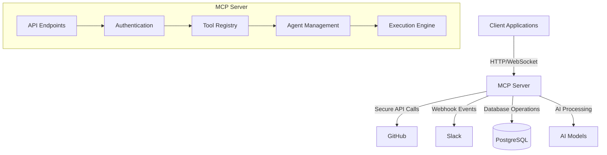

# MCP Server Implementation for EcoCI

This document provides an overview of the MCP (Multi-Component Protocol) Server implementation for the EcoCI project, which enables secure, scalable, and efficient communication between AI agents and external services.

## 📋 Overview

The MCP Server acts as a central hub that facilitates communication between various components of the EcoCI system, including:

- **GitHub Integration**: For repository analysis and CI/CD optimization
- **Slack Integration**: For notifications and interactive workflows
- **AI Agents**: For analyzing repositories and generating recommendations
- **Web Interface**: For user interaction and visualization

## 🏗️ Architecture



## 🔧 Setup and Installation

### Prerequisites

- Python 3.9+
- PostgreSQL 13+
- Redis (for rate limiting and caching)
- GitHub App credentials
- Slack App credentials

### Installation

1. Clone the repository:
   ```bash
   git clone https://github.com/yourusername/ecoci.git
   cd ecoci/backend
   ```

2. Create and activate a virtual environment:
   ```bash
   python -m venv venv
   source venv/bin/activate  # On Windows: .\venv\Scripts\activate
   ```

3. Install dependencies:
   ```bash
   pip install -r requirements.txt
   ```

4. Copy the example environment file and update with your credentials:
   ```bash
   cp .env.example .env
   # Edit .env with your configuration
   ```

5. Initialize the database:
   ```bash
   alembic upgrade head
   ```

6. Start the MCP server:
   ```bash
   uvicorn app.main:app --reload --host 0.0.0.0 --port 8000
   ```

## 🛠️ Available Tools

The MCP Server provides the following tools that can be used by agents:

### GitHub Tools
- `github.analyze_repository`: Analyze a GitHub repository for CI/CD inefficiencies
- `github.get_workflow_runs`: Get workflow runs for a repository
- `github.get_workflow_run_logs`: Get logs for a specific workflow run
- `github.create_issue`: Create a new GitHub issue

### Slack Tools
- `slack.send_message`: Send a message to a Slack channel or user
- `slack.open_modal`: Open a Slack modal dialog
- `slack.update_message`: Update an existing Slack message

## 🔒 Authentication

The MCP Server supports multiple authentication methods:

1. **API Key Authentication**: For service-to-service communication
2. **JWT Authentication**: For user-facing API endpoints
3. **OAuth 2.0**: For third-party application integration

## 📡 API Documentation

Once the server is running, you can access the following:

- **OpenAPI/Swagger UI**: http://localhost:8000/api/docs
- **ReDoc Documentation**: http://localhost:8000/api/redoc
- **OpenAPI Schema**: http://localhost:8000/api/openapi.json

## 🚀 Deployment

### Docker

```bash
docker-compose up --build
```

### Kubernetes

1. Apply the Kubernetes manifests:
   ```bash
   kubectl apply -f k8s/
   ```

2. Set up ingress and TLS (example for nginx-ingress):
   ```bash
   kubectl apply -f k8s/ingress.yaml
   ```

## 📈 Monitoring and Logging

The MCP Server includes built-in support for:

- **Prometheus Metrics**: Available at `/metrics`
- **Sentry Integration**: For error tracking and monitoring
- **Structured Logging**: JSON-formatted logs for easy parsing

## 🔄 Webhook Configuration

### GitHub Webhook

1. Go to your repository settings
2. Navigate to Webhooks → Add webhook
3. Set the payload URL to: `https://your-mcp-server.com/api/v1/webhooks/github`
4. Set content type to `application/json`
5. Add the following events:
   - Workflow run
   - Pull request
   - Push
6. Set the secret to match `GITHUB_WEBHOOK_SECRET`

### Slack Events API

1. Go to your Slack App settings
2. Navigate to Event Subscriptions
3. Enable events and set the Request URL to: `https://your-mcp-server.com/api/v1/webhooks/slack`
4. Subscribe to the following bot events:
   - `message.channels`
   - `message.im`
   - `app_mention`
   - `app_home_opened`

## 🤝 Contributing

1. Fork the repository
2. Create a feature branch (`git checkout -b feature/amazing-feature`)
3. Commit your changes (`git commit -m 'Add some amazing feature'`)
4. Push to the branch (`git push origin feature/amazing-feature`)
5. Open a Pull Request

## 📄 License

This project is licensed under the MIT License - see the [LICENSE](LICENSE) file for details.

## 🙏 Acknowledgments

- The MCP Server is built on top of FastAPI and leverages modern Python async features
- Inspired by the MCP (Multi-Component Protocol) specification
- Special thanks to all contributors who have helped improve this project
